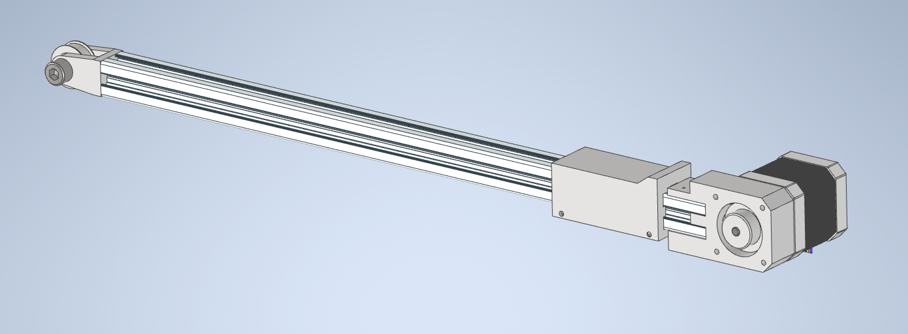

# stupid-linear-actuator

Stupid (Not really smart) Linear actuator to help with moving things.

STL files can be found in the STL folder. 

Initial version is based around 2020 aluminium extrusion. Other hardware:

    NEMA17 Stepper motor, 
    GT2-36-5mm Pulley, 
    Common microswitch 
    Appropriate length GT2 belt 
    2x M6x12, 
    4x M3x10
    2x ~M2.5 woodscrews 
    2x M3x30 or equivalent pins

Electronics are basically a copy of:

https://tasmota.github.io/docs/A4988-Stepper-Motor-Controller/

    Weemos D1 Mini
    A4988 Stepper Driver and carrier board
    Buck converter

with the addition of microswitch connected to the Weemos D1 Mini for homing

