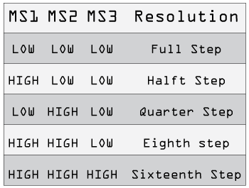
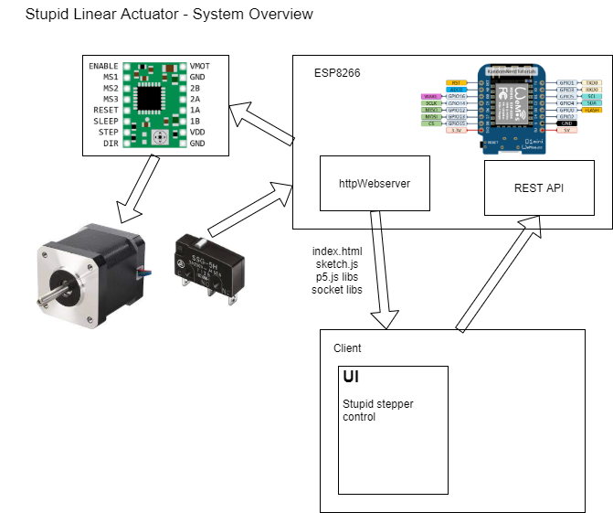

# stupid-linear-actuator

Stupid (Not really smart) Linear actuator to help with moving things.

STL files can be found in the STL folder. 

Initial version is based around 2020 aluminium extrusion. Other hardware:

    NEMA17 Stepper motor, 
    GT2-36-5mm Pulley, 
    Common microswitch 
    Appropriate length GT2 belt 
    2x M6x12, 
    4x M3x10
    2x ~M2.5 woodscrews 
    2x M3x30 or equivalent pins

Electronics are basically a copy of:

    https://tasmota.github.io/docs/A4988-Stepper-Motor-Controller/

# Weemos D1 Mini

WemosD1mini setup Instructions

    https://averagemaker.com/2018/03/wemos-d1-mini-setup.html

install CH340 driver for wemos d1 mini usb serial communication

    https://www.wemos.cc/en/latest/ch340_driver.html

if the driver doesn't want to install select uninstall and then install again. seemed to work

A4988 Stepper Driver and carrier board

    
    Buck converter

with the addition of microswitch connected to the Weemos D1 Mini for homing

## System Overview

# This bit is all new stuff to learn

A rest api for ESP8266
    https://github.com/marcoschwartz/aREST
    https://arest.io/

Separate Tutorial : REST server on esp8266 and esp32: introduction – Part 1
    https://www.mischianti.org/2020/05/16/how-to-create-a-rest-server-on-esp8266-and-esp32-startup-part-1/

ESP8266 HTTP server: Serving HTML, Javascript and CSS
    https://techtutorialsx.com/2016/10/15/esp8266-http-server-serving-html-javascript-and-css/

Voltage regulator and Motor driver
    https://www.pololu.com/product/1202 -- Got but discontinued