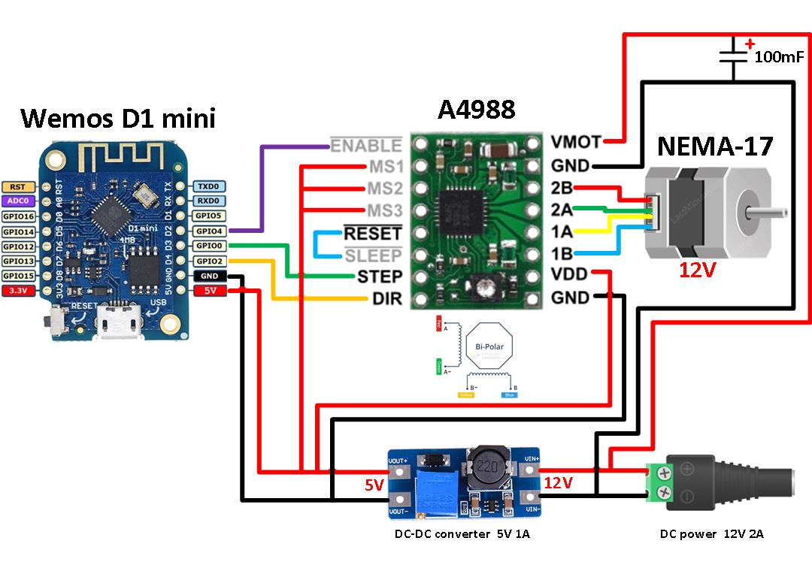
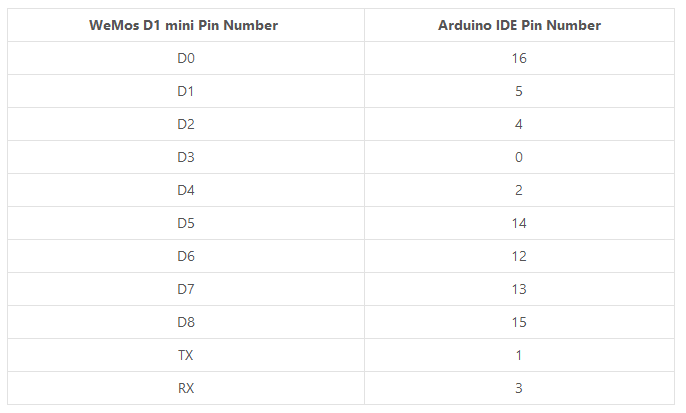

# stupid-linear-actuator

Stupid (Not really smart) Linear actuator to help with moving things.

STL files can be found in the STL folder. 

Initial version is based around 2020 aluminium extrusion. Other hardware:

    NEMA17 Stepper motor, 
    GT2-36-5mm Pulley, 
    Common microswitch 
    Appropriate length GT2 belt 
    2x M6x12, 
    4x M3x10
    2x ~M2.5 woodscrews 
    2x M3x30 or equivalent pins

## This Document.

This document is intended as a personal guide to doing all of the things and remembering all of the details associated with this project. If coming to this as a new reader, it would be helpful to understand what microcontrollers are, be comfortable using a code editor and at home with being confused. 

The idea is simple, give the actuator power and everything else is done remotely via a web interface or websocket connection. In this way, one, or multiple deviced can be controller from a central point. 

Maybe a person with a phone in a field. 
Maybe a server with node-red in a warehouse opening a vent.  
Maybe a python script, or a node.js bot.... you get the idea. 

I'll stop procrastinating now and get to the 'doing the plan' part.

# Electronics

Electronics are basically a copy of:

https://tasmota.github.io/docs/A4988-Stepper-Motor-Controller/

# Stepper Driver - A4983 (A4988 + Regulator) 
## (Discontinued) :(

A4988 Stepper Driver and carrier board
Voltage regulator and Motor driver
    https://www.pololu.com/product/1202 -- Got but discontinued

Prototypes Motor Wirings:

| A4988 Pin | MotorWire |
| --- | --- |
| 2B | Black |
| 2A | Green |
| 1A | Red |
| 2A | Blue |

# A4988 Jumper Settings

 
    
Unfortunately it is discontinued and will only be used on the prototypes for convenience. Future versions will require a buck converter.

# Buck converter

Not currently necessary  

# Homing Endstop

The addition of microswitch connected to the Weemos D1 Mini for homing is just a NC switch connected as a pulled up input to one of the wD1mini pins.

# System Overview

## Setting up the Wemos D1 mini

Specs: https://www.addicore.com/D1-Mini-Dev-Board-p/ad318.htm

Beginners Guide to the ESP8266 (Very Good) https://tttapa.github.io/ESP8266/Chap01%20-%20ESP8266.html

Setup Instructions: 
[Setup Tutorial](https://averagemaker.com/2018/03/wemos-d1-mini-setup.html)

Install CH340 driver for usb serial communication:
[Driver Installation [wemos.cc]](https://www.wemos.cc/en/latest/ch340_driver.html)

### Pin Numbering for Wemos in arduino IDE

If the driver doesn't want to install select uninstall and then install again. seemed to work

## Moving the stepper motor.

I've worked with the Accelstepper library before. So let's use that:

http://www.airspayce.com/mikem/arduino/AccelStepper/

Install it into the arduino IDE in the usual way. Release notes would suggest that it just works, but lets see!

Yeah, this helps:

https://www.makerguides.com/a4988-stepper-motor-driver-arduino-tutorial/

Also this for the pin numbering on the wd1m:

https://chewett.co.uk/blog/1066/pin-numbering-for-wemos-d1-mini-esp8266/

# This bit is all new stuff to learn

# ESP8266 HTTP server: Serving HTML, Javascript and CSS

If you want a human to interact with the device wirelessly, you need some way for them to input data comfortably... Why not a webpage?! That means you have to send all of the information about the webpage from the tiny microcontroller. So how do we do that? Well, this first link is good for very simple sites, but everything is embedded in the .ino file so things get a bit confusing and hard to read. But have a go anyway, it's kinda cool and just the sort of instant gratification that you might need. 
    
[ESP8266 HTTP server: Serving HTML, Javascript and CSS](https://techtutorialsx.com/2016/10/15/esp8266-http-server-serving-html-javascript-and-css/)

Now, if only we could upload some files to the esp8266? Maybe to that 4MB of flash of the SPI chip... what would you call SPI Flash File System for a webserver? Maybe SPIFFS... Yeah, SPIFFS sounds good

**[ESP8266 Web Server using SPIFFS (SPI Flash File System) – NodeMCU](https://randomnerdtutorials.com/esp8266-web-server-spiffs-nodemcu/)**

That will make you:

## 1. Install ESP8266 Board in Arduino IDE

We’ll program the ESP8266 using Arduino IDE, so you must have the ESP8266 add-on installed. Follow the next tutorial to install it:

[Install ESP8266 Board in Arduino IDE (Windows, Mac OS X, Linux)](https://randomnerdtutorials.com/how-to-install-esp8266-board-arduino-ide/) .... but you should have done this before now

## 2. Filesystem Uploader Plugin

To upload files to the ESP8266 SPI Flash Filesystem (SPIFFS), we’ll use the Filesystem Uploader Plugin. Install the plugin in your Arduino IDE:

[Install ESP8266 Filesystem Uploader in Arduino IDE](https://randomnerdtutorials.com/install-esp8266-filesystem-uploader-arduino-ide/)

## 3. Installing Libraries

Apparently, one of the easiest ways to build a web server using files from the filesystem is using the [ESPAsyncWebServer](https://github.com/me-no-dev/ESPAsyncWebServer) library. 

## 4. Installing the ESPAsyncWebServer library

This library is not available to download through the Arduino IDE libraries manager. So, you need to follow the next steps to install the library:

[Click here to download the ESPAsyncWebServer library.](https://github.com/me-no-dev/ESPAsyncWebServer/archive/master.zip) You should have a .zip folder in your Downloads folder
Unzip the .zip folder and you should get ESPAsyncWebServer-master folder
Rename your folder from ESPAsyncWebServer-master to ESPAsyncWebServer
Move the ESPAsyncWebServer folder to your Arduino IDE installation libraries folder

Alternatively, you can go to Sketch > Include Library > .zip Library and select the previously downloaded library.

## 5. Installing the ESPAsyncTCP

The ESPAsyncWebServer library also needs the ESPAsyncTCP library to operate properly. Follow the next steps to install the ESPAsyncTCP library:

    Click here to download the ESPAsyncTCP library. You should have a .zip folder in your Downloads folder
    Unzip the .zip folder and you should get ESPAsyncTCP-master folder
    Rename your folder from ESPAsyncTCP-master to ESPAsyncTCP
    Move the ESPAsyncTCP folder to your Arduino IDE installation libraries folder
    Finally, re-open your Arduino IDE

Alternatively, you can go to Sketch > Include Library > .zip Library and select the previously downloaded library.

# Websockets on the ESP8266

This is the starting point, but essentially use the Websocket_LED example and change the html and javascript to suit the needs of the stupid actuator.

Future work will involve making things look a bit nicer. This will mean getting rid of the inline javasctipt in the html file and using the SPI flash memory on the esp8266 (4MB) 

https://tttapa.github.io/ESP8266/Chap11%20-%20SPIFFS.html

https://www.mischianti.org/2020/12/07/websocket-on-arduino-esp8266-and-esp32-client-1/

https://github.com/Links2004/arduinoWebSockets

## How the ESP8266 Websocket stuff works

https://tttapa.github.io/ESP8266/Chap14%20-%20WebSocket.html

---

## Links that have made it down to the bottom of the page but not deleted

Yes, I was thinking of doing this with a rest server. I am still undecided, but for the timebeing. We're doing websockets.

A rest api for ESP8266
    https://github.com/marcoschwartz/aREST
    https://arest.io/

Separate Tutorial : REST server on esp8266 and esp32: introduction – Part 1
    https://www.mischianti.org/2020/05/16/how-to-create-a-rest-server-on-esp8266-and-esp32-startup-part-1/

           